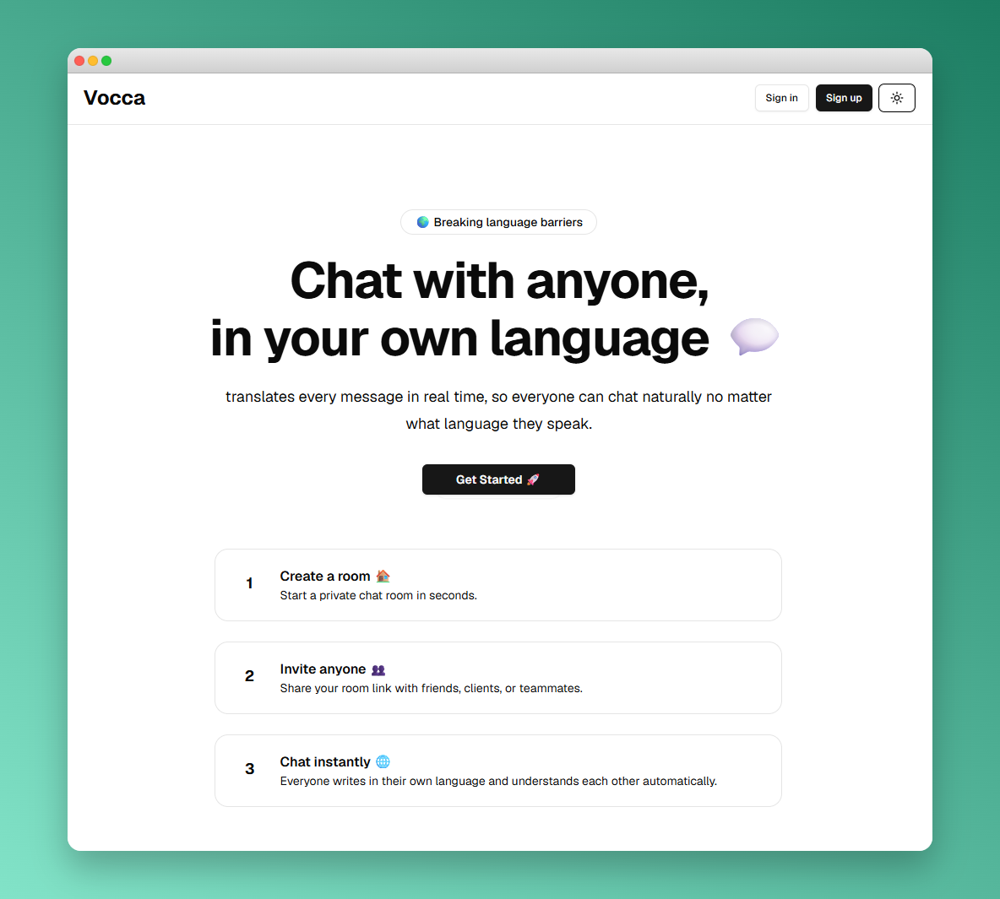

# Vocca 💬

---

## 💡 About This project

Vocca is a real-time multilingual chat application built to break language barriers in conversations.
Users can create chat rooms, invite people from different countries, and communicate naturally in their own language while Vocca automatically translates messages for every participant in real time.

 **The project focuses heavily on**:

* Real-time communication
* Automatic message translation
* Scalable room architecture
* Efficient translation handling
* Secure database access using RLS
* Clean service-based architecture

Vocca was built from scratch with a strong emphasis on production-ready architecture, realtime synchronization, and multilingual collaboration

## 🛠️ Built With & Key Tech
This project demonstrates my proficiency in:

*   **Frontend:** React, Next.js, TypeScript 
*   **Backend & Database:**  Supabase
*   **Translation System:**   OPEN API AI (prompt engineering & response handling)
*   **UX & Logic Handling:**   UX & Logic Handling: Async state management, form persistence, protected routes, request lifecycle handling (loading, cancel, error)
*   **Tools:**   Git, GitHub, Vercel (deployment), environment configuration

## 🚀 Key Features

🌍 Real-Time Multilingual Chat

Users can send messages in their own language while other participants instantly receive translated versions based on their preferred language.

⚡ Realtime Synchronization

Built using Supabase Realtime:

* Live chat updates
* Live sidebar updates
* Live room member updates
* Realtime room activity

👥 Multi-User Room Support

Users can:

* Create rooms
* Join rooms
* Invite multiple participants
* Chat simultaneously with different languages

🏗️ Service-Based Code Architecture

The project separates:

* Chat services
* Translation services
* Room services
* Realtime subscriptions
* API routes

This keeps the codebase scalable and maintainable as the application grows.